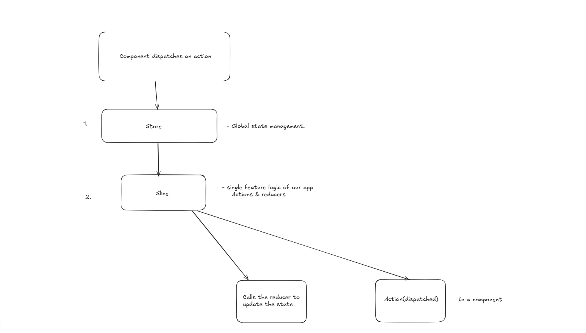

# Redux Toolkit (RTK) - Complete Guide

## Table of Contents
1. [What Is Redux?](#what-is-redux)
2. [Why Redux Toolkit?](#why-redux-toolkit)
3. [Installation](#installation)
4. [Core Concepts](#core-concepts)
5. [Key APIs](#key-apis)
6. [Building Your First Redux App](#building-your-first-redux-app)
7. [Advanced Patterns](#advanced-patterns)
8. [Best Practices](#best-practices)

---

## What Is Redux?

Think of Redux as a **central database** for your entire application's state. Instead of passing data through multiple components, you store it in one place that any component can access.

Redux is built on three core principles:

1. **Single Store**: One central location containing all your app's "global" state
2. **Actions**: Plain Typescript objects describing *what happened* in your app
3. **Reducers**: Pure functions that specify *how* the state changes in response to actions

### Simple Analogy
Imagine a library system:
- **Store** = The library's catalog (tracks all books)
- **Actions** = Request forms ("check out book", "return book")
- **Reducers** = Librarians who process requests and update the catalog

---

## Why Redux Toolkit?

Classic Redux involves a lot of boilerplate code. Redux Toolkit (RTK) is the **official, recommended way** to write Redux logic. It simplifies Redux dramatically:

**Before Redux Toolkit (Old Way):**
```js
// Action types
const ADD_TODO = 'ADD_TODO'

// Action creators
const addTodo = (text) => ({ type: ADD_TODO, payload: text })

// Reducer
const todosReducer = (state = [], action) => {
  switch (action.type) {
    case ADD_TODO:
      return [...state, { text: action.payload, completed: false }]
    default:
      return state
  }
}
```

**With Redux Toolkit (New Way):**
```js
const todosSlice = createSlice({
  name: 'todos',
  initialState: [],
  reducers: {
    addTodo: (state, action) => {
      state.push({ text: action.payload, completed: false })
    }
  }
})
```

Much simpler, right? RTK handles action types, action creators, and immutable updates automatically!

---

## Installation

```bash
# Using npm
npm install @reduxjs/toolkit react-redux

# Using pnpm
pnpm install @reduxjs/toolkit react-redux

```

---

## Core Concepts

### 1. Store

The single source of truth for your application state.

```ts
// app/store.ts
import { configureStore } from '@reduxjs/toolkit'

export const store = configureStore({
  reducer: {
    // Your reducers go here
  }
})

export type RootState = ReturnType<typeof store.getState>
export type AppDispatch = typeof store.dispatch
```

### 2. Slices
A "slice" is a collection of Redux logic for a single feature of your app.

```ts
// features/counter/counterSlice.ts
import { createSlice } from '@reduxjs/toolkit'

const counterSlice = createSlice({
  name: 'counter',
  initialState: { value: 0 },
  reducers: {
    increment: (state) => {
      state.value += 1
    },
    decrement: (state) => {
      state.value -= 1
    },
    incrementByAmount: (state, action) => {
      state.value += action.payload
    }
  }
})

export const { increment, decrement, incrementByAmount } = counterSlice.actions
export default counterSlice.reducer
```

### 3. Actions
Automatically generated by `createSlice`. You just export and use them!

### 4. Reducers
Functions that update state. RTK uses Immer library, so you can write "mutating" code that's actually immutable.

---

## Key APIs

### `configureStore()`
Sets up the Redux store with good defaults.

```ts
import { configureStore } from '@reduxjs/toolkit'
import todosReducer from './features/todos/todosSlice'
import filtersReducer from './features/filters/filtersSlice'

export const store = configureStore({
  reducer: {
    todos: todosReducer,
    filters: filtersReducer,
  },
  // Redux DevTools enabled by default
  // Redux Thunk middleware included automatically
})
```

### `createSlice()`
The main API you'll use. It accepts:
- `name`: String identifier for the slice
- `initialState`: Starting state value
- `reducers`: Object of reducer functions

```ts
import { createSlice, PayloadAction } from '@reduxjs/toolkit'

interface Todo {
  id: string
  text: string
  completed: boolean
}

const todosSlice = createSlice({
  name: 'todos',
  initialState: [] as Todo[],
  reducers: {
    todoAdded(state, action: PayloadAction<{ id: string; text: string }>) {
      state.push({
        id: action.payload.id,
        text: action.payload.text,
        completed: false,
      })
    },
    todoToggled(state, action: PayloadAction<string>) {
      const todo = state.find((todo) => todo.id === action.payload)
      if (todo) {
        todo.completed = !todo.completed
      }
    },
    todoDeleted(state, action: PayloadAction<string>) {
      return state.filter((todo) => todo.id !== action.payload)
    }
  },
})

export const { todoAdded, todoToggled, todoDeleted } = todosSlice.actions
export default todosSlice.reducer
```

## Building Your First Redux App

### Step 1: Set Up the Store

```ts
// app/store.ts
import { configureStore } from '@reduxjs/toolkit'
import todosReducer from '../features/todos/todosSlice'
import filtersReducer from '../features/filters/filtersSlice'

export const store = configureStore({
  reducer: {
    todos: todosReducer,
    filters: filtersReducer,
  },
})

export type RootState = ReturnType<typeof store.getState>
export type AppDispatch = typeof store.dispatch
```

### Step 2: Provide the Store to React

```tsx
// index.tsx
import React from 'react'
import ReactDOM from 'react-dom/client'
import { Provider } from 'react-redux'
import { store } from './app/store'
import App from './App'

const root = ReactDOM.createRoot(document.getElementById('root')!)
root.render(
  <Provider store={store}>
    <App />
  </Provider>
)
```

### Step 3: Create a Slice

```ts
// features/todos/todosSlice.ts
import { createSlice, PayloadAction } from '@reduxjs/toolkit'

interface Todo {
  id: string
  text: string
  completed: boolean
}

const todosSlice = createSlice({
  name: 'todos',
  initialState: [] as Todo[],
  reducers: {
    todoAdded(state, action: PayloadAction<{ id: string; text: string }>) {
      state.push({
        id: action.payload.id,
        text: action.payload.text,
        completed: false,
      })
    },
    todoToggled(state, action: PayloadAction<string>) {
      const todo = state.find((todo) => todo.id === action.payload)
      if (todo) {
        todo.completed = !todo.completed
      }
    },
  },
})

export const { todoAdded, todoToggled } = todosSlice.actions
export default todosSlice.reducer
```

### Step 4: Create Custom Hooks (TypeScript)

```ts
// app/hooks.ts
import { TypedUseSelectorHook, useDispatch, useSelector } from 'react-redux'
import type { RootState, AppDispatch } from './store'

// Use throughout your app instead of plain `useDispatch` and `useSelector`
export const useAppDispatch: () => AppDispatch = useDispatch
export const useAppSelector: TypedUseSelectorHook<RootState> = useSelector
```

### Step 5: Use Redux in Components



```tsx
// features/todos/TodoList.tsx
import React, { useState } from 'react'
import { useAppSelector, useAppDispatch } from '../../app/hooks'
import { todoAdded, todoToggled } from './todosSlice'

export function TodoList() {
  const [text, setText] = useState('')
  const todos = useAppSelector((state) => state.todos)
  const dispatch = useAppDispatch()

  const handleSubmit = (e: React.FormEvent) => {
    e.preventDefault()
    if (text.trim()) {
      dispatch(todoAdded({
        id: Date.now().toString(),
        text: text.trim()
      }))
      setText('')
    }
  }

  return (
    <div>
      <form onSubmit={handleSubmit}>
        <input
          value={text}
          onChange={(e) => setText(e.target.value)}
          placeholder="Add todo"
        />
        <button type="submit">Add</button>
      </form>

      <ul>
        {todos.map((todo) => (
          <li
            key={todo.id}
            onClick={() => dispatch(todoToggled(todo.id))}
            style={{
              textDecoration: todo.completed ? 'line-through' : 'none',
              cursor: 'pointer'
            }}
          >
            {todo.text}
          </li>
        ))}
      </ul>
    </div>
  )
}
```
---

## Best Practices

### 1. **Structure Your Files by Feature**
```
src/
  features/
    todos/
      todosSlice.ts
    users/
      usersSlice.ts
```

### 2. **Use TypeScript**
RTK has excellent TypeScript support. Always type your state and actions.

### 3. **Keep Slices Focused**
Each slice should manage one feature or domain of your app.

### 4. **Don't Put Everything in Redux**
Only put global state in Redux. Component-specific state can stay in `useState`.

### 5. **Use RTK Query for API Calls**
Instead of managing loading states manually, use RTK Query for seamless data fetching.

### 6. **Normalize Complex Data**
Use `createEntityAdapter` for collections of items.

### 7. **Use Selectors for Derived State**
Create memoized selectors with `createSelector` to compute derived data.

---

## Quick Reference

| Task | API to Use |
|------|-----------|
| Set up store | `configureStore()` |
| Create reducers & actions | `createSlice()` |
| Async logic | `createAsyncThunk()` |
| Manage collections | `createEntityAdapter()` |
| Memoized selectors | `createSelector()` |
| API integration | RTK Query (`createApi()`) |

---

## Common Mistakes to Avoid

❌ **Mutating state directly outside of createSlice**
```ts
// Don't do this:
state = [...state, newItem]
```

✅ **Use Immer's "mutating" syntax in createSlice**
```ts
// Do this:
state.push(newItem)
```

❌ **Dispatching actions inside reducers**
❌ **Making async calls in reducers**
✅ **Use createAsyncThunk for async logic**

❌ **Storing non-serializable data (functions, promises) in state**
✅ **Keep state serializable (plain objects, arrays, primitives)**

---

## Resources

- [Redux Toolkit Documentation](https://redux-toolkit.js.org/)
- [Redux Essentials Tutorial](https://redux.js.org/tutorials/essentials/part-1-overview-concepts)
- [Redux DevTools Extension](https://github.com/reduxjs/redux-devtools)

---

## Summary

Redux Toolkit makes Redux easier to use by:
- Reducing boilerplate code
- Providing sensible defaults
- Including best practices out of the box
- Enabling "mutating" syntax for immutable updates
- Simplifying async logic with `createAsyncThunk`
- Offering powerful data fetching with RTK Query

Start with `createSlice()` and `configureStore()`, then explore advanced features as needed!